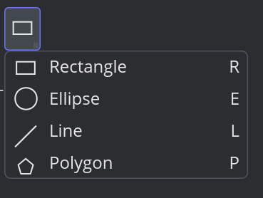

# iced_tool_flyout

[](https://crates.io/crates/iced_tool_flyout) [](https://docs.rs/iced_tool_flyout)

A Photoshop-style tool-group button for [Iced](https://github.com/iced-rs/iced).



The button shows the icon of the currently-selected tool plus a small corner
indicator. Left-clicking activates that tool. **Right-clicking** or
**long-pressing** (~400ms) opens a flyout popup listing related variants;
picking one swaps the button's icon to the new variant. Subsequent left-clicks
then activate the newly-selected variant.

## Usage

```rust
use iced::widget::{text, column};
use iced_tool_flyout::{tool_flyout, tool_item};

#[derive(Debug, Clone, Copy, PartialEq, Eq)]
enum Shape { Rectangle, Ellipse, Line, Polygon }

#[derive(Debug, Clone)]
enum Message { Activated(Shape) }

fn view() -> iced::Element<'static, Message> {
    tool_flyout(
        vec![
            tool_item(Shape::Rectangle, text("▭")).label("Rectangle").shortcut("R"),
            tool_item(Shape::Ellipse,   text("◯")).label("Ellipse").shortcut("E"),
            tool_item(Shape::Line,      text("╱")).label("Line").shortcut("L"),
            tool_item(Shape::Polygon,   text("⬠")).label("Polygon").shortcut("P"),
        ],
        Message::Activated,
    )
    .default_selected(Shape::Rectangle)
    .into()
}
```

## State model

The widget is **uncontrolled** — it remembers the currently-selected variant
itself across renders. Supply `.default_selected(value)` to pick an initial
variant (defaults to the first item).

If you need the selection to live in your app state, attach an
`.on_select(Message::ToolChanged)` callback and mirror it there.

## Programmatic selection

Assign an [`Id`] and use [`select`] to change the active variant from your
`update` function:

```rust
use iced::Task;
use iced_tool_flyout::{Id, select};

// In view():
tool_flyout(items, Message::Activated)
    .id(Id::new("shapes"))
    // ...

// In update():
fn update(&mut self, message: Message) -> Task<Message> {
    match message {
        Message::SwitchToEllipse => select(Id::new("shapes"), Shape::Ellipse),
        _ => Task::none(),
    }
}
```

## License

Dual-licensed under MIT or Apache-2.0, at your option.
